# OpenCRA

[](https://github.com/crwncode/opencra/actions/workflows/ci.yml)
[](https://pypi.org/project/opencra/)
[](https://pypi.org/project/opencra/)
[](LICENSE)
[](https://github.com/crwncode/opencra/blob/main/action.yml)

**CRA Article 14 reporting starts 11 September 2026.** Know if you have a CISA KEV hit in one command.

OpenCRA is the open-source CLI and GitHub Action for Software Bills of Materials and actively-exploited vulnerability candidates. [CRA-Shield](https://cra-shield.com) is the optional hosted control plane for team workspaces, the 24-hour awareness clock, and SRP-ready evidence packs.

A scanner hit is a **candidate**, never legal awareness. Article 14 clocks start only after a human assessment. OpenCRA does not file with ENISA, does not claim CE marking, and is not a notified body.

<p align="center">
  
</p>

```bash
uvx opencra scan .
```

## EU Cyber Resilience Act (CRA) Compliance in 60 Seconds

1. **Generate an SBOM** — Syft inventories your directory or image (or pass an existing CycloneDX file).
2. **Map every PURL to OSV + CISA KEV** — OpenCRA tells you which findings are on the Known Exploited Vulnerabilities catalog. Those are the ones that *may* start a 24-hour CRA clock after you become aware.
3. **Fail CI or export evidence** — drop the Action into GitHub, or write CycloneDX / SPDX / a community PDF.

```yaml
- uses: crwncode/opencra@v1
  with:
    fail-on-cve: true
```

Local scans are free. No account required. When your compliance team asks for the 24h/72h reporting clock, run `opencra scan . --sync-cloud` or visit [cra-shield.com](https://cra-shield.com).

## Install

Syft is auto-installed to `~/.opencra/bin` on first online directory scan, or `brew install syft`. CycloneDX JSON files do not need Syft.

```bash
# uv — no install
uvx opencra scan .

# pip / pipx
pipx install opencra
# or: pip install opencra

# Homebrew — Syft first, then the CLI
brew install syft pipx
pipx install opencra
```

```bash
opencra doctor
opencra kev refresh
opencra scan . --fail-on kev
```

## GitHub Action

Published from this repo (`crwncode/opencra@v1`). Search **OpenCRA** on the GitHub Marketplace.

```yaml
name: CRA
on: [push, pull_request]
jobs:
  opencra:
    runs-on: ubuntu-latest
    steps:
      - uses: actions/checkout@v4
      - uses: crwncode/opencra@v1
        with:
          fail-on-cve: true
```

| Input | Default | Meaning |
|---|---|---|
| `fail-on-cve` | `false` | Fail the job on a CISA KEV hit |
| `fail-on` | `kev` | `none` \| `kev` \| `critical` \| `high` |
| `target` | `.` | Directory, image, or CycloneDX JSON |
| `sync-cloud` | `false` | POST results to CRA-Shield (`OPENCRA_API_KEY`) |

See [packages/action/README.md](packages/action/README.md) for every input.

## Why not just Syft or Grype?

| Tool | What it does |
|---|---|
| Syft | Generates an SBOM |
| Grype / osv-scanner | Finds known CVEs |
| **OpenCRA** | Tells you which findings are **CISA KEV** hits — the ones that *may* start a 24-hour CRA clock after you become aware |

## CLI

```bash
# Syft is auto-installed to ~/.opencra/bin on first online directory scan, or:
brew install syft          # macOS
# Linux: https://github.com/anchore/syft#installation

pipx install opencra
# or run without installing:
uvx opencra doctor
uvx opencra scan .
```

## Quickstart

```bash
opencra doctor
opencra kev refresh
opencra scan . --fail-on kev
opencra scan . --format cyclonedx --output sbom.cdx.json
opencra scan . --export-pdf cra-report.pdf
opencra scan . --sync-cloud          # optional CRA-Shield ingest
opencra report --last
# Demo a KEV candidate (exit 1). Not legal awareness; do not auto-file.
opencra scan examples/sample-kev.cdx.json --fail-on kev
```

After a table scan:

```text
[+] Scan complete: 0 critical vulnerabilities found.
[i] Need automated 24h/72h CRA clocks and SRP-ready evidence packs?
    Run with --sync-cloud or visit https://cra-shield.com
```

`--quiet` and machine formats (`json`, `cyclonedx`, `spdx`) keep stdout clean. Full flag list: [docs/cli.md](docs/cli.md).

## Legal disclaimer

OpenCRA prepares evidence and highlights Known Exploited Vulnerabilities. It does **not**:

- start the Article 14 legal clock automatically
- file notifications on the ENISA Single Reporting Platform
- certify CRA compliance or CE marking

The 24-hour early warning and 72-hour notification run from **awareness**. The 14-day final report for actively exploited vulnerabilities runs from when a **corrective measure is available**, not from detection. Severe incidents have a one-month final report after the 72-hour notification.

## CRA-Shield (optional hosted control plane)

```bash
uv sync --all-packages --group dev
uv run uvicorn opencra_api.main:app --app-dir apps/api --reload
cd apps/web && npm install && npm run dev
```

See [docs/saas.md](docs/saas.md). `--sync-cloud` on the CLI posts scans to `/v1/ingest`.

## Open core

The CLI, Action, Syft wrapper, OSV + KEV matching, and local reports are Apache 2.0. CRA-Shield (hosted clocks, audit trail, SRP packs, SSO) is commercial.

## License

Apache License 2.0. Copyright 2026 crwncode.
